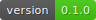

# Logger



An implementation of a logger in Python .

### Installation

To install only the package:
```
make pkg
```

To install everything (including dev dependencies):
```
make install
```

### Utils
To make a general check on the files. After it runs, if it is successful, you should be in a state that you are ready to commit.
```
make check
```

To run static analysis and formatting:
```
make check-format
```

To run unit tests:
```
make test
```

To generate badges:
```
make badge
```

To build docs:
```
make build-docs
```

To clean up:
```
make clean
```
